# Self-made icons
          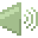 

# scripts
## Mount/Unmount using dmenu

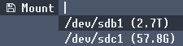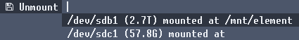

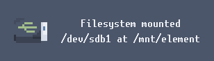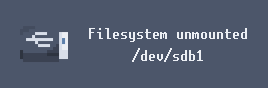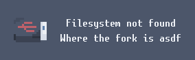
## Power
change systemd power state and lock using [slock](https://tools.suckless.org/slock/)

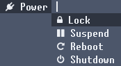

# dwm
## statusbar
My dwm statusbar. Font is [unscii](http://pelulamu.net/unscii/).


Dependencies: ```pacman pulseaudio pamixer speedtest-cli xorg-xsetroot coreutils```

What it displays:
* Download/upload speed, recheck every 10 minutes
* How much space is used in the root partition, package count
* Pulseaudio volume
* Time and date

## Keybind menu
1) Using dmenu or dunst
Just pipe the text [file](scripts/key) to dmenu or [file](key-dunst) to dunst
If you want dunst to display it correctly, change these in dunstrc: alignment to ``left``, line-height to ``0``

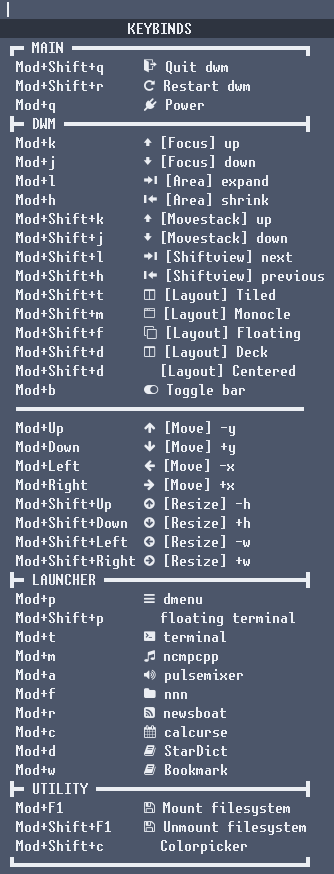
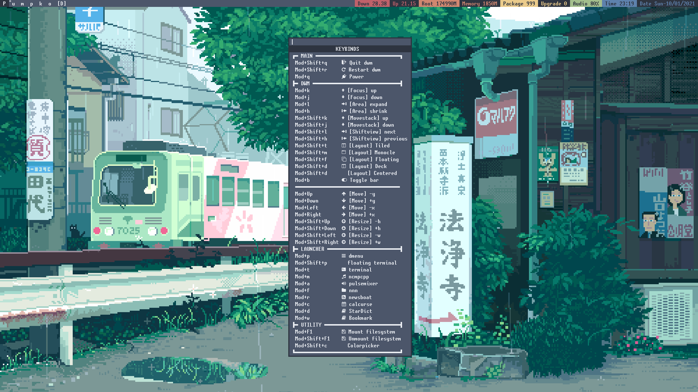
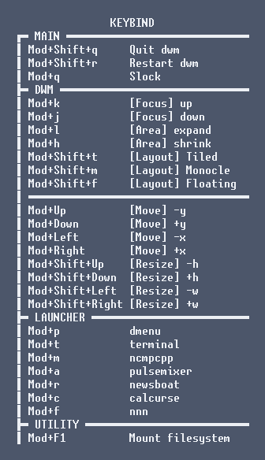
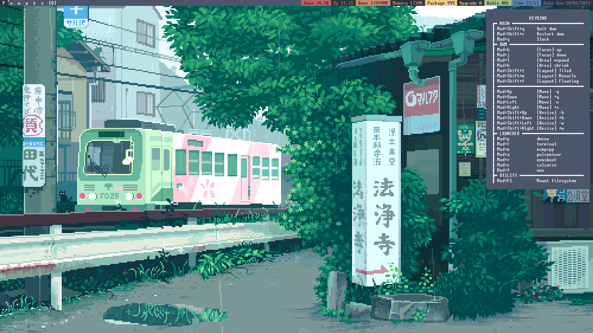

2) Using dmenu but more practical
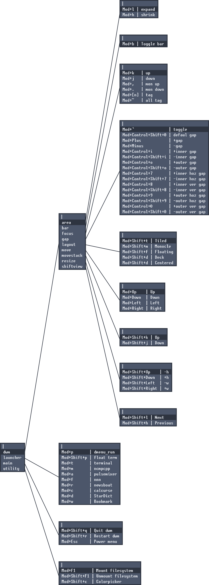


## prompt
### PS1
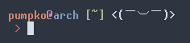

It display different kaomoji depending on if the command succeeds or fails

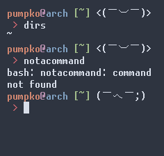
### PS2
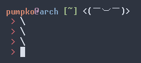

# Theme
## Firefox
### userChrome.css
My modification of [dpcdpc11's Nord for Firefox](https://www.deviantart.com/dpcdpc11/art/Nord-for-Firefox-837860916).

* Removed urlbar expansion
* Everything round corners
* Added colors for menus
* Changed tabs' colors

It's not finished yet, I'll work on it when I have time.
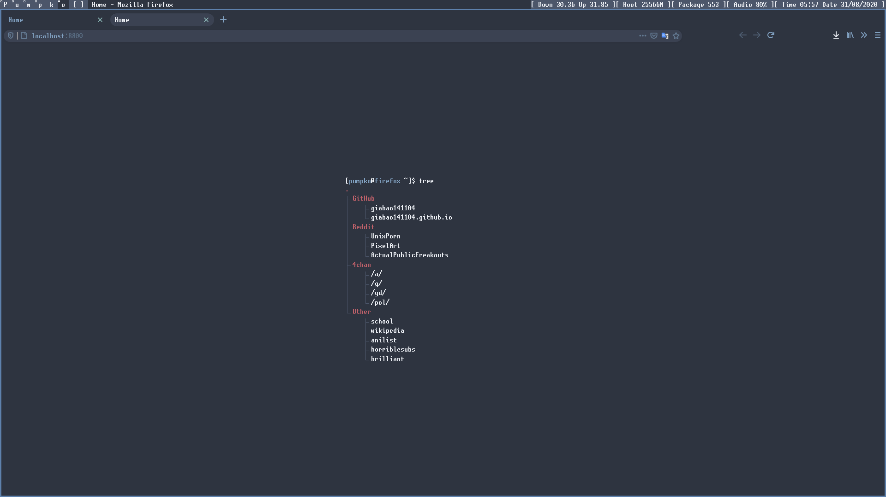
### stylus
#### Wikipedia
[udscbt](https://github.com/udscbt-wsx/udscbt-userstyles) inspired stylesheet for wikipedia with nord theme! Still working on this.

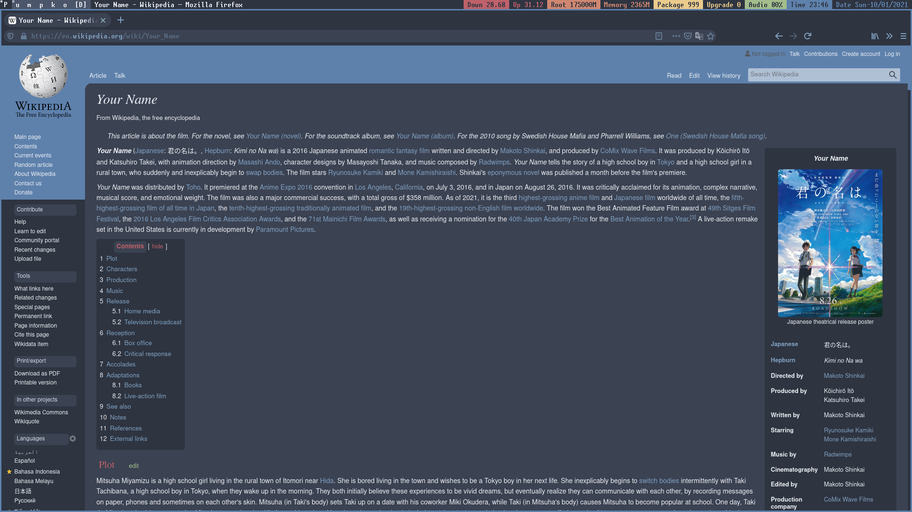

## Gimp
nord theme
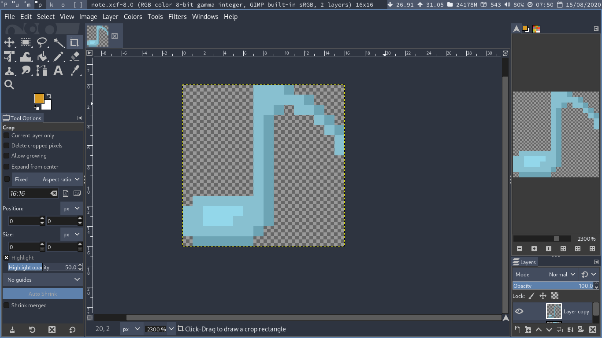
