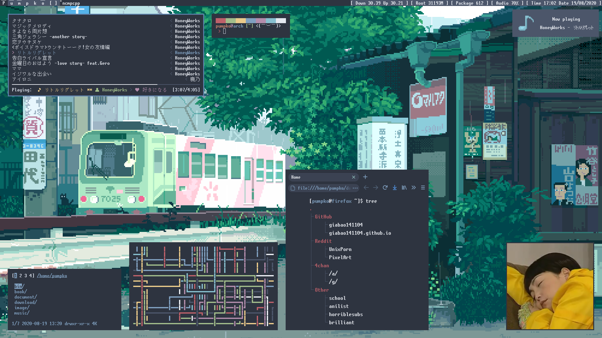
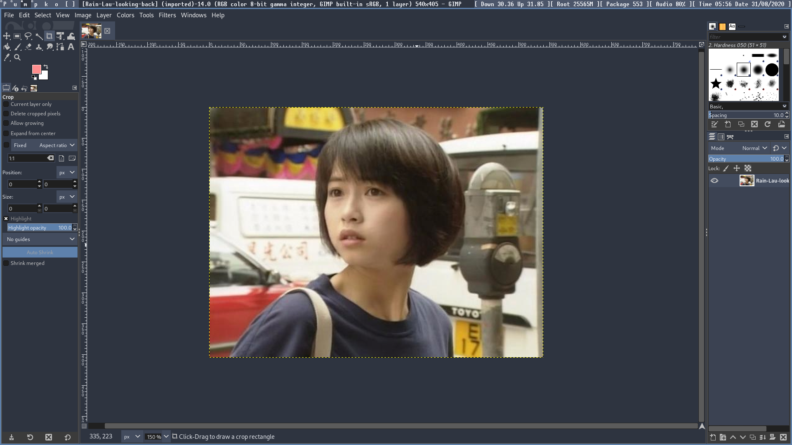

# Update
Screenshot because I like this [unscii](http://pelulamu.net/unscii/) font (and just bought a 1080p monitor)


# system
## Mount/Unmount using dmenu
I made all the icons myself! :)


## Power
change systemd power state and lock using [slock](https://tools.suckless.org/slock/)


# dwm
## statusbar
My dwm statusbar. Font is [sourcecodepro](https://www.archlinux.org/packages/extra/any/adobe-source-code-pro-fonts/), emojis are from [awesome](https://www.archlinux.org/packages/community/any/awesome-terminal-fonts/)


List of softwares: ```pacman pulseaudio pamixer speedtest-cli xorg-xsetroot coreutils```

What it displays:
* Download/upload speed, recheck every 10 minutes
* How much space is used in the root partition, package count
* Pulseaudio volume
* Time and date

# Theme
## Firefox
### userChrome.css
My modification of [dpcdpc11's Nord for Firefox](https://www.deviantart.com/dpcdpc11/art/Nord-for-Firefox-837860916).

* Removed urlbar expansion
* Everything round corners
* Added colors for menus
* Changed tabs' colors

It's not finished yet, I'll work on it when I have time.

### stylus
#### Wikipedia
[udscbt](https://github.com/udscbt-wsx/udscbt-userstyles) inspired stylesheet for wikipedia with nord theme! Still working on this.


## Gimp
nord theme


# Extra
## Keybind menu
### Dunst
Script [here](bin/dunst-key). You'll have to set dunst's alignment to ```left```.


### dmenu
Just pipe the text [file](bin/key) to dmenu.


## prompt
### PS1


It display different kaomoji depending on if the command succeeds or fails


### PS2

## Discord mpd rich presence (mpd-pumpko)


I modified [SSStormy's mpd-rich-presence-discord](https://github.com/SSStormy/mpd-rich-presence-discord) to change the large image. Here's how you can do it too!
1. Dependencies ```discord-rpc libmpdclient```
2. Make an [application](https://discord.com/developers/applications)
3. Upload the 3 buttons in the ```mpd-rich-presence-discord/assets/discord/png/``` to Art Assets under the Rich Presence tab. Rename them to ```pause-circle_png play-circle_png refresh-cw_png``` respectively
4. Find a good image and upload it to Art Assets, rename to ```mpd_large```
5. Change all the AppId in ```mpd-rich-presence-discord/src/main.cpp``` to the one you just made
6. Run build.sh and the executable file should be in ```mpd-rich-presence-discord/release```
